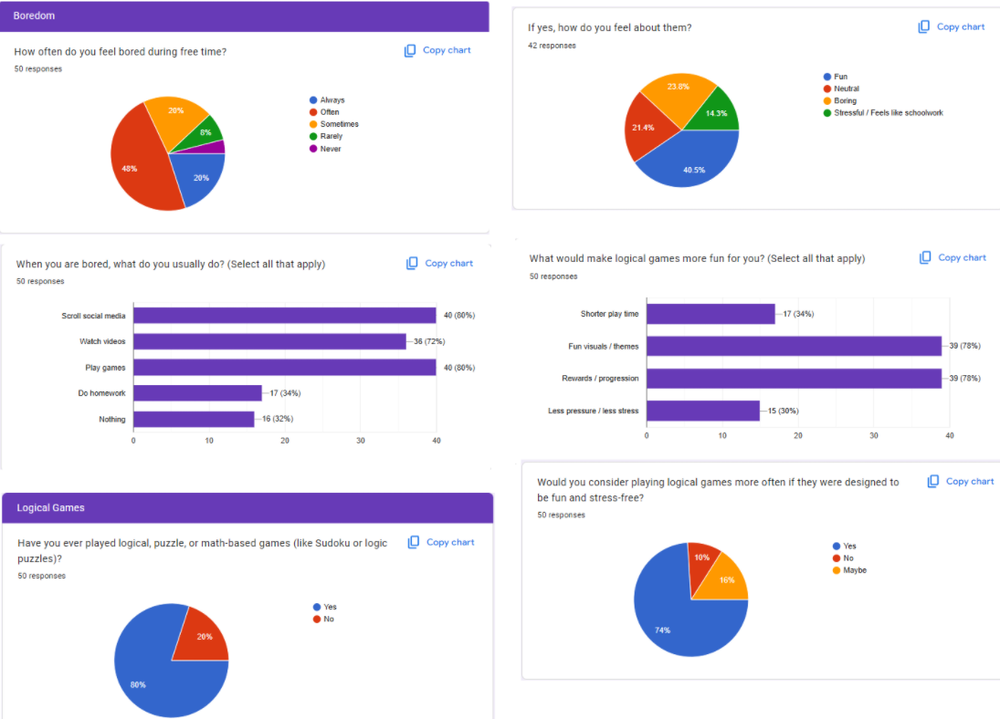

# Entry 3: MORE LEARNING
##### 2/7/26

## What more have I learned from Phaser?
From the last time we talked which was less than 2 months ago, I've only gotten better with using Phaser. Without speaking too much, Let's cover all I've learned.

### 2nd Sprite + WASD Movement
Frogs might not seem like social creatures but they are. In a lonely world like the one I created, he needs another social creature in order to survive. Therefore **I added a boy sprite:**

``` js
// Just like creating the frog sprite, it's the same code but different preload and variable name
let player2 = this.physics.add.sprite(250, 400, 'boy');
player2.setScale(0.2).setBounce(0.2).setCollideWorldBounds(true);
this.physics.add.collider(player2, platforms);
```

It would be pretty dehumanizing if the boy couldn't move right? So I gave it MOVEMENTS but WITH THE WASD KEY since the frog is controlled through the arrow keys.

``` js
// Section 1
var keys = this.input.keyboard.addKeys({
    up: 'W',
    left: 'A',
    down: 'S',
    right: 'D'
});
// Section 2
if (wasdKey.left.isDown)
{
    player2.setVelocityX(-160);
}
else if (wasdKey.right.isDown)
{
    player2.setVelocityX(160);
}
else
{
    player2.setVelocityX(0);
}

if (wasdKey.up.isDown && player2.body.touching.down)
{
    player2.setVelocityY(-330);
}
```
* Section 1 identifies key inputs or in order words, WASD = up, left, down, right
* Section 2 puts those identified key inputs into action by giving them velocity or movement speed on each key input


### Collectable

So we have mobile sprites in our world of platforms. It still looks very boring because although they can jump around doing parkour, I think we need something they can collect... something like... COINS COLLECTABLE. **Here's what I did:**

``` js

// Section 1
coins = this.physics.add.group({
    key: 'coins',
    repeat: 4,
    setXY: { x: 12, y: 0, stepX: 70 }
});

// Section 2
coins.children.iterate(function (child) {
    child.setScale(0.1);
});

// Section 3
function collectCoin (player, coins)
{
    coins.disableBody(true, true);
}

this.physics.add.collider(coins, platforms);
this.physics.add.overlap(player1, coins, collectCoin, null, this);
this.physics.add.overlap(player2, coins, collectCoin, null, this);
```

* Section 1 makes the coins appear 4 times, spaced 70 units between each other horizontally starting at the 12 units (by the way, you'll need to save/import/preload like every other thing I've added to my world)
* Section 2 will scale the coins to a reasonably small size so it doesn't take up the whole screen
* Section 3 makes coins collidable with other things (sprites and the platforms). The function above the `.physics` makes it that the sprite can now pass through the coin and when they do pass through the coin, the coin disappears/ is collected which is why there's `.disableBody`

## What's next for Phaser?
It's very simple and I already have it planned it out
* **#1**: Learn how to make a score system with the connections with coins
* **#2**: TRY to learn how to create a unlockable (keys unlock locks to escape)
* **#3**: TRY to learn animations (sprite sheets/animation frames)
* **#4**: Learn how to make a death system (touch something, sprite dies ... maybe a monster? Tag type of game?)
* **#5**: Learn how to make levels that are connected (Complete level 1 and it takes you to level 2 and so on)

## WINTER BREAK GOALS CHECK-UP
* My first goal was to create collectables which I achieved (POINT SYSTEM W.I.P)
* My second goal was to create a mini project and sadly I didn't complete or even started but when I learn everything I'll need to know, there will be a big surprise at the end of the year
* My third goal was to brainstorm ways for my final game which I achieved (I will share on 5th bullet point)
* My fourth goal was to communicate with Xin Yu to help him out but I didn't even need to because he's back into business
* My fifth goal was to conduct a survey on boredom and logical games and I completed it
    * There are 50 people who took the survey:


---

## Engineering Design Process (EDP)
I am OFFICIALLY finished with the 2nd step, **Research the problem** and I am moving onto the 3rd, **Brainstorm possible solutions**. Based on the survey, majority of the respondent are often bored and use games to deal with it which sets up the next pieces of data. Majority has also played logical types of games with most having positive feedbacks but they want more and thus majority also chose better look for the game and rewarding/progressing (which implies levels). Overall, I'm brainstorming of a game that fits those needs and I do have an idea: A 


[Previous](entry02.md) | [Next](entry04.md)

[Home](../README.md)
