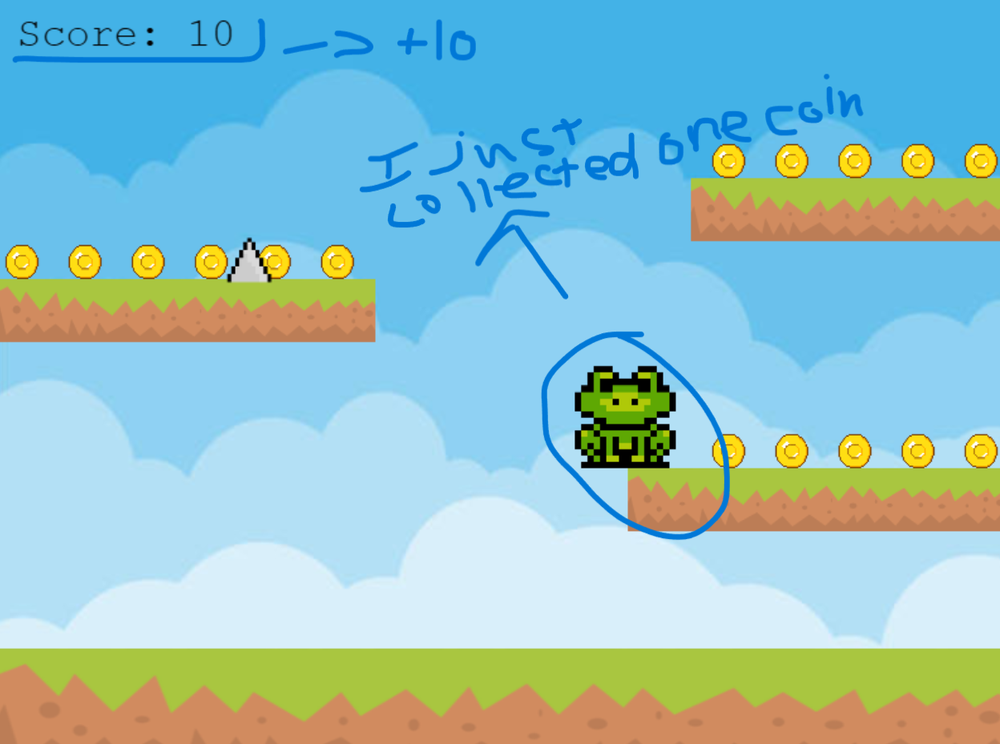

# Entry 4: PLANNING PHASE
##### 3/13/26

## What more MORE have I learned about Phaser?

### [Score System](https://phaser.io/tutorials/making-your-first-phaser-3-game/part9)
Yes yes YES it's finally here... a score system that is connected to the very shiny coins I've added to the game. Originally, I thought it would be a difficult process to make a score system but one place I forgot to double check was the Phaser page because I found out they literally teach you how to make a score system (click the header for the link). **BELOW IS EXAMPLE:**

``` js
var score = 0;
var scoreText;

function create ()
{
    // a score visual that pops up in the corner of your canvas
    scoreText = this.add.text(16, 16, 'score: 0', { fontSize: '32px', fill: '#000' });
    // you're adding onto an already existing function that I previously made (the log above this one)
    function collectCoin (player1, coins)
    {
        coins.disableBody(true, true);

        score += 10;
        scoreText.setText('Score: ' + score);
    }
}
```

The score system is like an add-on to the code that collects coins. So the function `collectCoin` runs as so: When player collides with a coin, the coin's body is disabled/disappears and it add +10 to the score board displayed via `.setText('Score: ' + score)`.



### Death System
Well this one was much more difficult to make. Originally, I visited the Phaser site to search for it. In the "Making your first Phaser 3 game", there was the "[Bouncing Bombs](https://phaser.io/tutorials/making-your-first-phaser-3-game/part10)" part and although it had a death system, it was not what I was looking for because their "death" subject was a bomb that MOVED (I wanted a static spike) and the "game over" death (I wanted a respawn death). So after spending 30 minutes of my life of trying to figure out a way to make a death system that respawns via collision with spikes, **here's what I made:**

``` js
var spikes;
var spikeCreate;
function create()
{
    spikes = this.physics.add.staticGroup();
    spikeCreate = spikes.create(200, 210, 'spikes');
    spikeCreate.setScale(0.4).refreshBody();
    this.physics.add.overlap(player1, spikes, function() {
        player1.setPosition(350, 400);
        score = 0;
        scoreText.setText('Score: 0');
    }, null, this);
}
```
**Breakdown:**
* Created 2 global variables (necessary)
* `spikes = this.physics.add.staticGroup();` makes it an immovable; not affected by gravity
* `spikeCreate = spikes.create(200, 210, 'spikes');` creates a spike at a position
* `this.physics.add.overlap(player1, spikes, function() { player1.setPosition(350, 400); score = 0; scoreText.setText('Score: 0'); }, null, this);` similar to the [**coins overlapping**](https://phaser.io/tutorials/making-your-first-phaser-3-game/part8#:~:text=this.physics.add.overlap(player%2C%20stars%2C%20collectStar%2C%20null%2C%20this)%3B), it looks for when `player1` comes into contact with `spikes` vice versa. When it does happen, it runs a function to which `player1` respawns at original spawn position of `(350, 400)`, resetting user's score to 0. `null` and `this` are necessary to include; no explanation because I don't know much about it.

That's all the major things I've learned using Phaser! Thanks! now let's move on...

## MVP Progress

The score and death system are progress of MVP. Why? Just look at my long plan... Well I am not going to copy and paste it here so just click on this link -> [**HERE**](../../our-first-game/plan.md)

I made one change to the plan and that is I am removing the dates of which we have to do each part of the MVP. Reason is that I AM VERY BUSY WITH SCHOOL. Setting these deadlines is putting more pressure on me and I don't want to stress about it constantly. New plan is that me and my partner Xin Yu will learn everything we need for the MVP based on the plan on our own time but NO PROCRASINATING. It seems like this plan is working better because I've already learned how to make a score and death system which meets 2 of our major game MVP parts.

**TIP:** WATCH YOUTUBE VIDEOS ON HOW TO BE A BETTER TIME MANAGER. FOR EXAMPLE, I HAVE ADHD SO I WATCHED VIDEOS LIKE -> [**How To Power Through ADHD: Proven Strategies to Crush Tough Tasks**
](https://www.youtube.com/watch?v=yj6_1t1PAcE) or [**How To Master Time Management – ADHD Skills Part 1**](https://www.youtube.com/watch?v=fWRF6BJ1OQk)

## Engineering Design Process
I sped through the 3rd step: **Brainstorm possible solutions** and sped through step 4: **Plan the most promising solution**. Currently, I can confidently say that we are in between step 4 and 5: **Create a prototype**. What this means is we are still planning/learning what we need to do to meet our MVP requirements but also 'creating' the prototype; I am testing things out behind the scenes with Phaser.

## Skills

### Communication
Since I have a partner for this team project, I've gotten WAY better with communicating. I tell my partner everything about my plan or he tells me what he is thinking about. I feel like without communication, it will be very hard to know what your partner needs or wants. For example, if my partner wants a very cool looking character but isn't communicating with me, I can't accommodate for him/her or figure something out. It's about creating a connection while also keeping it professional. It's like that one advice: "Communication is key" so for my future self, a team needs connections, not disconnection.

### Time Management + Growth Mindset
For some context before I begin explaining, I am currently under a lot of stress from the responsibility of school and other personal issues. Now do I really want to spiral deeper into the rabbit hole or do I want escape? It's not possible to escape it though... but I can relieve some stress to lift myself somewhat upwards. This is possible through managing my schedule for work and keeping a strong mindset. Remember how I talked about the adjustment I made on my MVP plan? Yeah I used time management to relieve stress and for me to do this is a sign that I am trying to grow a better mindset and not bury myself in deadline stress. New plan is to work at my own pace but not overly relaxed since there's an ACTUAL deadline. The new mindset I've built for myself is really helping me deal with all the other external stressors. The lesson is that like an equilibrium under stress, adjust until you reach equilibrium even if it might feel different (Chemistry reference).


## Next Step
ALL I HAVE TO SAY IS WHEN I AM DONE WITH LEARNING ALL THE PHASER THINGS I NEED TO KNOW FOR THE MVP, I WILL BE SUCCESSFULLY AND FULLY COMMITTED TO **Step 5: Creating a prototype**. JUST HOPE THE BEST FOR ME AND I'LL SEE YOU IN THE NEXT EPISODE!!! DON'T FORGET TO LIKE AND SUBSCRIBE


[Previous](entry03.md) | [Next](entry05.md)

[Home](../README.md)
