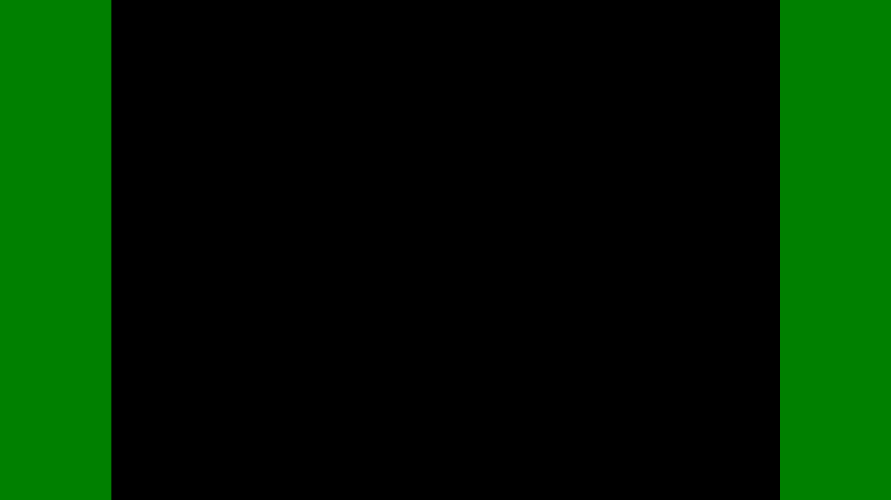
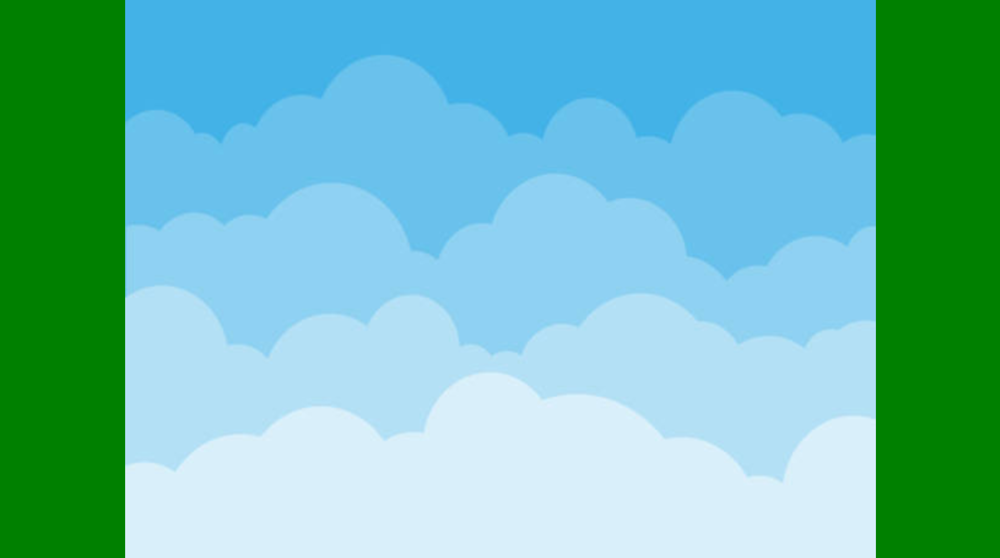
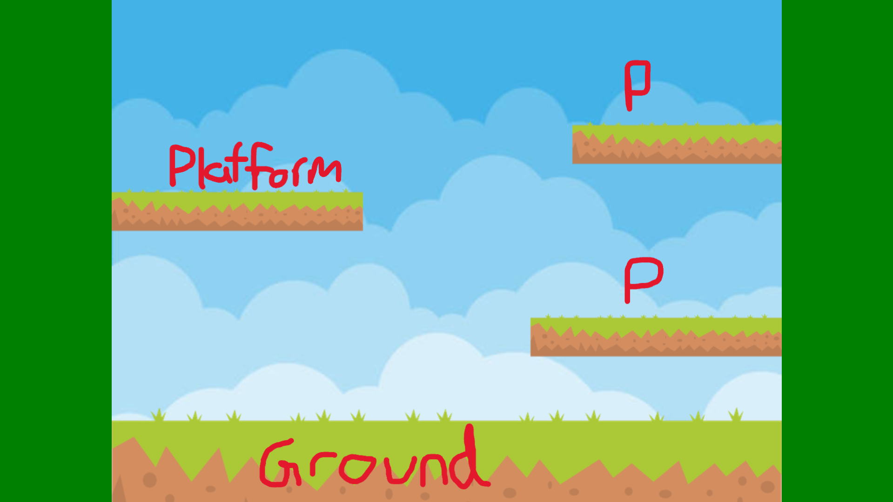
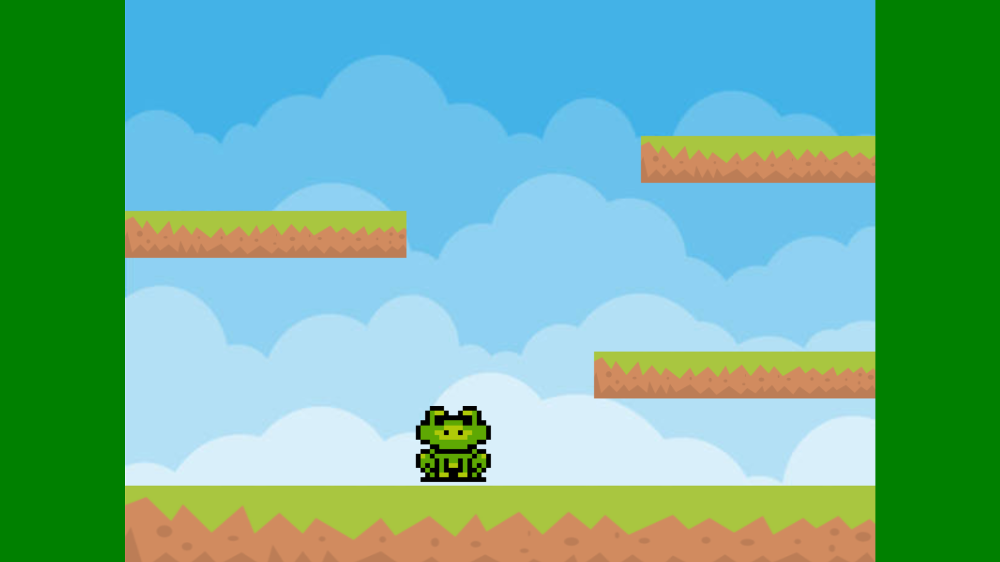

# Tool Learning Log

## Tool: **Phaser**

## Project: **Game**

---

### 10/3/25:
* I learned how to create a game canvas
  * First I'll need the "**starting"** code from [**Phaser**](https://phaser.io/tutorials/making-your-first-phaser-3-game/part1#:~:text=var%20config%20%3D%20%7B%0A%20%20%20%20type%3A%20Phaser.AUTO%2C%0A%20%20%20%20width%3A%20800%2C%0A%20%20%20%20height%3A%20600%2C%0A%20%20%20%20scene%3A%20%7B%0A%20%20%20%20%20%20%20%20preload%3A%20preload%2C%0A%20%20%20%20%20%20%20%20create%3A%20create%2C%0A%20%20%20%20%20%20%20%20update%3A%20update%0A%20%20%20%20%7D%0A%7D%3B%0A%0Avar%20game%20%3D%20new%20Phaser.Game(config)%3B)
  ``` js
    var config = {
        type: Phaser.AUTO,
        width: 800,
        height: 600,
        scene: {
            preload: preload,
            create: create,
            update: update
        }
    };

    var game = new Phaser.Game(config);
  ```
  * `type: Phaser.AUTO` is the game canvas or the screen where the user will see all the content. Adding `width: 800` and `height: 600` will size the game canvas
  * However, I want my game canvas to be in the center of the page so it requires some css and Phaser code:
  ``` html
    <style>
        /* CSS */
        html, body {
            margin: 0;
            padding: 0;
            width: 100%;
            height: 100%;
            display: flex;
            justify-content: center;
            align-items: center;
            background-color: green;
        }
        #game-container {
            width: 100%;
            height: 100%;
            display: flex;
            justify-content: center;
            align-items: center;
        }
    </style>
    <script>
        var config = {
            type: Phaser.AUTO,
            scale: {
                mode: Phaser.Scale.FIT,
                parent: 'game-container',
                width: 800,
                height: 600,
            },

            scene: {
                preload: preload,
                create: create,
                update: update
            }
        };

        var game = new Phaser.Game(config);
    </script>
  ```
**Result:**



### 10/27/25:
* I learned how to add an background... but in my way!
  * Before I reveal my own method, I hit a obstacle and that was the assets for backgrounds wouldn't load
``` js
// these aren't the exact example, I just took parts of the phaser code to use as example.
function preload ()
{
    this.load.image('sky', 'assets/sky.png');
}

function create ()
{
    this.add.image(400, 300, 'sky');
}
```
* **The issue:** I don't have the phaser assets folder downloaded into my html page. This means I'll have to create my own folder.
* **The solution:** I created a directory/folder called `assets` in my `tool` parent directory. Then I downloaded a sky image online and put it into `assets`. Lastly...

**My "Method":**
``` js
function preload ()
{
    this.load.image('sky', 'assets/sky.jpg');
}

// 'sky' = the name of the image
// 'assets/sky.jpg' = access the assets folder then grabs the sky.jpg file

function create ()
{
    let sky = this.add.image(400, 300, 'sky');
    sky.setDisplaySize(800, 600);
}
// To summarize, the sky image is given a position of (400, 300) which is the center of the canvas. Then it is given the same size of the canvas so it is the background.
```

**Result:**


### 11/15/25
* I found out how to add ACTUAL platforms to my canvas!
* Here's where I went to get the starter code: [The Platforms](https://phaser.io/tutorials/making-your-first-phaser-3-game/part4)
    * First I found an ground 2d image online, put it in my [assets](assets/ground.jpg) folder, and then preloaded it for future use
    * Then I pasted the starter codes into the create function
``` js
function create()
{
    platforms = this.physics.add.staticGroup();
    platforms.create(400, 568, 'ground').setScale(2).refreshBody();
    platforms.create(600, 400, 'ground');
    platforms.create(50, 250, 'ground');
    platforms.create(750, 220, 'ground');
}
```
* `platforms = this.physics.add.staticGroup` = gives "platform" or a group of "platforms" collision and is completely immovable by any other external factors.
* `.setScale(2)` = size scaling
* `.refreshBody()` = updates the "platforms" collision hitbox so it fits the new size/ position
* `platforms.create()` = create a "platform" and can give it (x, y) location + the preload name.
* I did some changes because the copied code didn't meet my expectations
    * Only scaled the size of first platform shown in this code while the rest are just default; they're really big on my screen and I wanted to resize it.
    * Plan: One big ground as the floor and 3 same sized platforms located differently
``` js
function create ()
{
    let platforms = this.physics.add.staticGroup(); // Changes to variable; can prevent errors and more

    platforms.create(400, 568, 'ground').refreshBody(); // The ground; separate entity from the platforms code below it

    // Since I want 3 platforms with same size, I created a function to refactor.
    function ground (x,y) {
    return platforms.create(x, y, 'ground') // so each platform can have their own position
        .setDisplaySize(300, 250) // hard-coded size = same size
        .refreshBody();
    }

    // Calls ground function = same size but argument are different for position x,y
    ground(650, 400);
    ground(150, 250);
    ground(700, 170);
}

```

**Result:**


### 11/23/25
* The world seems alone so I added a sprite! (like a character, not the soda)
    * Here's the [Phaser template](https://phaser.io/tutorials/making-your-first-phaser-3-game/part5), however I barely used this template to create my character besides copy the first four line of code on that page:

    ``` js
    let player = this.physics.add.sprite(350, 100, 'frog');
    player.setScale(0.07).setBounce(0.2).setCollideWorldBounds(true);
    // not on tutorial page; searched it up on google
    this.physics.add.collider(player, platforms);
    ```
    * `this.physics.add.sprite(350, 100, 'frog');` = creates a frog character with physics
    * `player.setScale(0.07).setBounce(0.2).setCollideWorldBounds(true);` = resized the wrong, add bounce to it when it lands, makes it collide with the bottom of the canvas
    * `this.physics.add.collider(player, platforms);` = the frog can now collide with the platforms... HOWEVER
* I ran into a problem with the platform and that is the transparent background image I used was a bad idea. The system registered the transparent background as part of collision so the frog was technically floating 5 feet above a platform.
* So instead of panicking, I simply found the original image, cropped out the platform ONLY and replaced the old `ground.jpg`.
* Also did some minor changes to size scaling which are pretty minor... but I did make the big floor a variable itself so whenever I change something about it, it doesn't affect other platforms.

**Final code:**
``` js
// needed to be its own variable or mix up with the code can happen
let floor = platforms.create(400, 568, 'ground').refreshBody();
floor.setDisplaySize(800, 100);
...
// important part or the collision part
let player = this.physics.add.sprite(350, 100, 'frog');
player.setScale(0.07).setBounce(0.2).setCollideWorldBounds(true);
this.physics.add.collider(player, platforms);
// if I wanted to put my frog on one of the 3 floating platforms, i just enter the exact x-value of the platform and the y-value just a bit higher.

```

**Result:** When entering the page, he'll fall and land exactly there, with a little bit of bouncing


### 12/7/25
* My frog has too much potential energy so I decided to add controls to make him move!
* Here's the [Phaser Template](https://phaser.io/tutorials/making-your-first-phaser-3-game/part7) I copied from but I also edited some of the code
``` js
function update () {
    cursors = this.input.keyboard.createCursorKeys(); // lets phaser be aware to detect arrow keys
    if (cursors.left.isDown) // left arrow
    {
        player.setVelocityX(-160); // speed when moving left

        player.anims.play('left', true); // left moving animation
    }
    else if (cursors.right.isDown) // right arrow
    {
        player.setVelocityX(160); // speed when moving right

        player.anims.play('right', true); // right moving animation
    }
    else
    {
        player.setVelocityX(0); // not moving; rest

        player.anims.play('turn'); // rest animation
    }

    if (cursors.up.isDown && player.body.touching.down) // up arrow
    {
        player.setVelocityY(-330); // jumping
    }
}
```
* This code would completely turn my screen black and that issue was the local variables such as player nested EXCLUSIVELY to the create function thus anything in the update function with using player wouldn't work. Thus I created a global variable: `var player;` and deleted anything that is a variable in the create function; I also did this with cursor -> `var cursors` in global (outside of functions).
* Now my screen isn't black and I could actually move around but looking close at console, I noticed that holding down the right, left, or even standing still will create a lot of error message: "missing animation". Then I realized that I don't have the phaser imported animations and so I removed animations.

**Final Code:**

``` js
    // global variables so it's accessible/ can be used by functions
    var cursors;
    var player;
    ...
    // in function update, no more animations -> player.anims.play()
    function update ()
    {
        cursors = this.input.keyboard.createCursorKeys();
        if (cursors.left.isDown)
        {
            player.setVelocityX(-160);
        }
        else if (cursors.right.isDown)
        {
            player.setVelocityX(160);
        }
        else
        {
            player.setVelocityX(0);
        }

        if (cursors.up.isDown && player.body.touching.down)
        {
            player.setVelocityY(-330);
        }
    }
```
**Result:**

https://github.com/user-attachments/assets/0777e99e-e276-4899-bb81-f8145c284bc2

### 12/14/25
* The frog is lonely so let's add a friend (that can move; 2 player on one keyboard)
    * I didn't go on the [**phaser**](https://phaser.io/) website... I searched up "WASD keyboard phaser" and got [**this**](https://phaser.discourse.group/t/wasd-keyboard-movement-phaser-3/8297/2#:~:text=Key%2C%20D%3A%20Key%20%7D-,var,-keys%20%3D%20this.input) <-- click this
``` js
// from website but I organized it
var keys = this.input.keyboard.addKeys({
    up: 'W',
    left: 'A',
    down: 'S',
    right: 'D'
});
```
* **READ IF NEEDED:** You'll have to add another global variables that works for the 2nd sprite (mines: `var player2;` & `var wasdKey;`) and also repeat what you did for frog in create function but change the variable label used so it functions (scroll up to **11/23/25** for collisions and physics in create)
* Not much to explain for the code above but the `.addKeys` is important if you want to literally add keys to which you can modify its function when clicked as **shown below:**

``` js
if (wasdKey.left.isDown)
{
    player2.setVelocityX(-160);
}
else if (wasdKey.right.isDown)
{
    player2.setVelocityX(160);
}
else
{
    player2.setVelocityX(0);
}

if (wasdKey.up.isDown && player2.body.touching.down)
{
    player2.setVelocityY(-330);
}
```

**Result:**

*the boy sprite is the WASD movement*

https://github.com/user-attachments/assets/5a6ff262-ffc7-402c-858b-4217c9dce4bf


### 1/15/26
* The world still looks boring so I added something that can be collected: **COINS!!!**
  * Here's the [**Phaser Template**](https://phaser.io/tutorials/making-your-first-phaser-3-game/part8)

``` js
// Copied from Template but modified since I wanted coins (google texture not phaser's)

// Section 1
coins = this.physics.add.group({
    key: 'coins',
    repeat: 4,
    setXY: { x: 12, y: 0, stepX: 70 }
});

// Section 2
coins.children.iterate(function (child) {
    child.setScale(0.1);
});

// Section 3
function collectCoin (player1, coins)
{
    coins.disableBody(true, true);
}

this.physics.add.collider(coins, platforms);
this.physics.add.overlap(player1, coins, collectCoin, null, this);
this.physics.add.overlap(player2, coins, collectCoin, null, this);
```
* Section 1 is basically the coin spawner. It takes the texture of the coin, spawns it and repeats it 4 more times (5 coins), spaced 70 X-distance between each other
* Section 2 is to scale the coins to a smaller size because they were huge before scaled
* Section 3 gave coins collision relationship with the platforms and also allowed both sprites, the frog and the boy, to collect the coins

<!--
* Links you used today (websites, videos, etc)
* Things you tried, progress you made, etc
* Challenges, a-ha moments, etc
* Questions you still have
* What you're going to try next
-->
